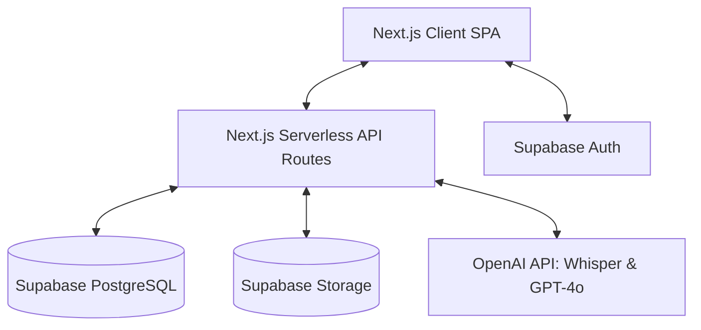
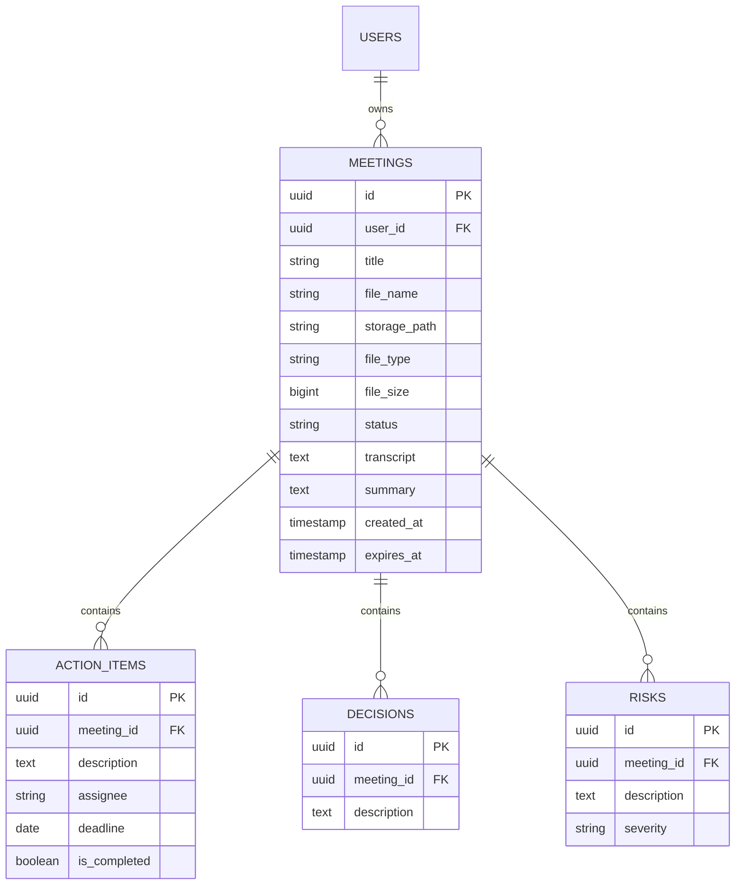

# Software Requirements Specification (SRS)

## AI Meeting Intelligence Assistant – Phase 2

**Version:** 1.0.0  
**Status:** Approved  
**Date:** June 19, 2026  
**Author:** AI Lead Architect  

---

## 1. Introduction

### 1.1 Purpose
This document specifies the software requirements for Phase 2 of the **AI Meeting Intelligence Assistant**. It outlines the functional and non-functional requirements, user interfaces, database schema design, and technical constraints required to implement the recording upload, automatic transcription, AI-driven meeting analysis, dashboard management, and search features.

### 1.2 Scope
The scope of Phase 2 is to transform the Phase 1 transcript summarizer into a full-featured web application. The application will allow users to:
- Upload audio and video recording files (MP4, MOV, MP3, WAV).
- View file upload progress.
- Automatically transcribe the uploaded media using speech-to-text technology (OpenAI Whisper).
- Extract AI insights (summary, key decisions, action items with deadlines, and risk factors).
- Manage previous meetings through a visual, searchable dashboard.
- Maintain a rolling 30-day retention window for uploaded meetings.

Out of scope for Phase 2 are native integrations (Zoom, Google Meet, Slack, Jira), team collaboration spaces, real-time streaming transcription, user billing, and advanced cross-meeting analytics.

### 1.3 Definitions, Acronyms, and Abbreviations
- **SRS**: Software Requirements Specification
- **PRD**: Product Requirements Document
- **STT**: Speech-to-Text
- **LLM**: Large Language Model
- **MVP**: Minimum Viable Product
- **Supabase**: Backend-as-a-Service (BaaS) providing PostgreSQL, authentication, and object storage.
- **Vercel**: Cloud platform for hosting Next.js frontends and serverless API routes.
- **Whisper**: OpenAI's speech recognition model.

### 1.4 References
- [Product Requirements Document (PRD)](file:///c:/Users/biraj/OneDrive/Desktop/AI%20PM%20Porfolio/AI-Meeting-Notes-2/prd.md)

---

## 2. Overall Description

### 2.1 Product Perspective
The AI Meeting Intelligence Assistant operates as a standalone web application built using Next.js (App Router), styled with Tailwind CSS and Shadcn UI components, and integrated with Supabase for data, auth, and object storage. AI operations (Speech-to-Text and Insight Summarization) are executed via secure server-side API routes calling OpenAI's Whisper and GPT APIs.

### 2.2 Product Functions
The high-level functions of the system include:
1. **User Authentication**: Secure sign-up, login, and session management.
2. **Media Uploading**: Upload of audio/video files with client-side progress tracking and serverless upload delegation to Supabase Storage.
3. **Speech-to-Text Processing**: Automatic audio extraction and transcription using OpenAI Whisper.
4. **AI Meeting Summarization**: Deep-text analysis to isolate summary, decisions, action items, deadlines, and risks.
5. **Dashboard Management**: Searching, listing, and retrieving previously processed meetings.
6. **Data Retention Management**: Automatic soft or hard deletion of files and database records older than 30 days.

### 2.3 User Classes and Characteristics
- **Professionals (Product Managers, Team Leads, Founders, Engineering Managers)**:
  - Technical Literacy: High.
  - Frequency of Use: Daily or weekly, following meetings.
  - Primary Need: Rapid extraction of actionable details from long discussions without manual note-taking.

### 2.4 Design and Implementation Constraints
- **File Size & Timeout Limits**: Serverless execution environments (Vercel) have a default execution timeout (typically 15s to 300s depending on plan). Upload processing and Whisper API calls must bypass these limits using asynchronous processing or direct storage-to-AI pipelines.
- **Storage Constraints**: Free-tier storage limitations on Supabase require a strict 30-day retention cleanup.
- **Privacy and Data Security**: Uploaded files contain confidential business discussions. All files must be secured with Row Level Security (RLS) policies in Supabase.

### 2.5 Assumptions and Dependencies
- **API Availability**: Uninterrupted availability of the OpenAI API and Supabase BaaS.
- **Network Bandwidth**: Users have sufficient upload speed to upload files up to 100MB in size.
- **Media Formats**: The system assumes uploaded MP4, MOV, MP3, and WAV files are non-corrupted and contain readable audio.

---

## 3. Specific Requirements

### 3.1 Functional Requirements

#### 3.1.1 Feature 1: User Authentication & Onboarding
- **FR-1.1**: The system shall allow users to register an account using email/password.
- **FR-1.2**: The system shall authenticate users and redirect them to their secure Meeting Dashboard.
- **FR-1.3**: The system shall isolate each user's data so they can only view and search their own uploaded meetings.

#### 3.1.2 Feature 2: Meeting Recording Upload
- **FR-2.1**: The user interface shall provide a drag-and-drop zone supporting MP4, MOV, MP3, and WAV files.
- **FR-2.2**: The system shall limit file sizes to a configurable limit (default: 100MB) and display a clear validation error if exceeded.
- **FR-2.3**: During upload, the client interface shall display a real-time progress bar (0% to 100%).
- **FR-2.4**: Uploaded files shall be written to a private bucket in Supabase Storage with path pattern `user_id/meeting_id/file_name`.

#### 3.1.3 Feature 3: Speech-to-Text Transcription
- **FR-3.1**: Upon successful upload, the system shall initiate the transcription process.
- **FR-3.2**: The system shall extract audio (if the file is video) and send the audio stream to the OpenAI Whisper API.
- **FR-3.3**: The system shall save the generated plain-text transcript in the database linked to the meeting record.
- **FR-3.4**: If transcription fails, the meeting status shall be updated to `failed` and a user-friendly error message displayed.

#### 3.1.4 Feature 4: AI Meeting Analysis & Insight Extraction
- **FR-4.1**: Immediately following successful transcription, the system shall send the text to OpenAI GPT-4o-mini or GPT-4o.
- **FR-4.2**: The LLM prompt must request a structured JSON payload containing:
  - **Summary**: Concise high-level overview.
  - **Decisions**: List of distinct key decisions made.
  - **Action Items**: List of actions, each with an assigned Owner (if mentioned) and Deadline (if mentioned).
  - **Risks**: List of project blockers, risks, or dependencies identified.
- **FR-4.3**: The structured JSON response shall be parsed and persisted in corresponding tables/JSONB columns.

#### 3.1.5 Feature 5: Meeting Dashboard
- **FR-5.1**: The dashboard shall list all meetings created by the logged-in user, sorted chronologically (newest first).
- **FR-5.2**: Each meeting card/row shall show: Title, Status (`processing`, `completed`, `failed`), Date/Time of creation, and Action Item Count.
- **FR-5.3**: Clicking a meeting shall navigate the user to the Meeting Details view.

#### 3.1.6 Feature 6: Search Functionality
- **FR-6.1**: The dashboard shall contain a search bar matching inputs against the Meeting Title and Transcript text.
- **FR-6.2**: Search results shall update dynamically on the client side or trigger lightweight API queries using PostgreSQL Full-Text Search.

#### 3.1.7 Feature 7: Data Retention Policy (30-day storage)
- **FR-7.1**: A background worker or cron job shall execute daily to identify meeting records created more than 30 days ago.
- **FR-7.2**: The system shall delete the associated raw audio/video files from Supabase Storage and remove or soft-delete the database record.

---

## 4. External Interface Requirements

### 4.1 User Interfaces
- **Design Style**: Sleek dark-mode aesthetic with vibrant accent colors, using custom fonts (e.g., Inter/Outfit) and micro-interactions (e.g., hover scaling, active state indicator glows).
- **Dashboard Layout**: Side navigation menu (Home, Upload, History) with a central grid layout for meeting cards.
- **Details Layout**: Split-pane layout: Left pane displays the transcript; Right pane displays tabs for Summary, Decisions, Action Items (checkbox list), and Risks.

### 4.2 Software Interfaces
- **Supabase JS Client**: Database queries, user auth sessions, and bucket storage.
- **OpenAI API SDK**: Whisper transcription (`v1/audio/transcriptions`) and Chat Completions (`v1/chat/completions`) for meeting intelligence parsing.

---

## 5. Non-Functional Requirements

### 5.1 Performance
- **Upload Response**: File metadata creation must complete in less than 500ms.
- **Transcription & Summarization Latency**: Processing time should scale with file length (expected: < 30 seconds for a 5-minute meeting; < 3 minutes for a 30-minute meeting).
- **UI Responsiveness**: Page navigation transitions must take less than 150ms.

### 5.2 Reliability and Availability
- **System Availability**: Target uptime of 99.9% excluding vendor platform outages.
- **Error Handling**: Graceful recovery and fallback values for failed LLM JSON parsing.

### 5.3 Security
- **Data Isolation**: PostgreSQL Row Level Security (RLS) must be enabled on all tables, verifying `auth.uid() = user_id`.
- **Storage Protection**: Read permissions for storage objects must require authenticated user tokens matched to the path prefix.
- **Secret Management**: API keys (OpenAI, Supabase Service keys) must be stored in secure environment variables on Vercel and never exposed to the client.

### 5.4 Maintainability
- Modular Next.js API Routes separating controller logic, external API clients, and database interactions.
- Strictly typed TypeScript interfaces for all database entities and LLM response payloads.

---

## 6. Database Schema Design

